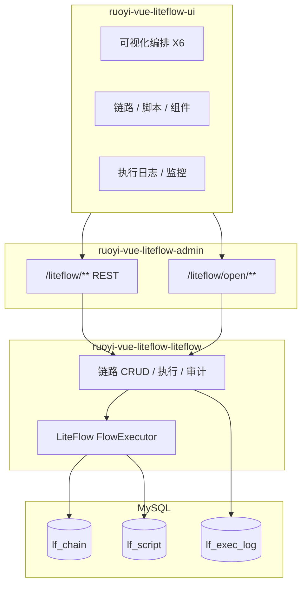

# RuoYi-Vue-LiteFlow

<p align="center">
  <a href="https://gitee.com/zhbdream/ruoyi-vue-liteflow">Gitee</a> ·
  <a href="https://github.com/zhbdream/RuoYi-Vue-LiteFlow">GitHub</a>
</p>

<p align="center">
  <strong>开箱即用的 Java 业务编排中台</strong><br/>
  若依权限后台 + LiteFlow 2.16 规则引擎 + AntV X6 可视化编排
</p>

<p align="center">
  拖拽画流程 · EL 双向同步 · 规则热更新 · 执行监控 · 开放 API
</p>

---

## 简介

**RuoYi-Vue-LiteFlow** 在 [若依 RuoYi-Vue](http://ruoyi.vip/) 管理框架之上，集成 [LiteFlow](https://liteflow.cc/) 轻量级规则引擎，补齐官方缺失的 **Web 可视化编排** 与中台能力：链路生命周期、脚本管理、执行日志、监控仪表盘、权限审计与对外执行 API。

适合作为团队内部的 **规则编排中台**，或二次开发业务编排、动态定价、风控策略等场景的基础工程。

> **定位说明：** 本项目专注 **LiteFlow 逻辑编排**。

---

## 功能亮点

| 能力 | 说明 |
|------|------|
| **可视化编排** | AntV X6 画布，THEN / IF / SWITCH / WHEN / FOR / CATCH，EL 实时预览与双向同步 |
| **规则生命周期** | 草稿 / 发布、版本快照、EL diff、回滚、克隆、导入导出、从模板创建 |
| **执行与调试** | 链路试跑、EL 在线调试（`execute2RespWithEL`）、步骤高亮、失败节点定位 |
| **脚本 & 组件** | Groovy / QLExpress 脚本管理，组件中心与引用分析 |
| **开放集成** | `/liteflow/open/execute` + API Key / Token 鉴权 |
| **权限 & 审计** | 菜单 RBAC、链路级执行/编排权限、规则变更审计 |
| **监控** | 成功率、调用趋势、链路 Top、慢调用 / 失败 Top |
| **决策路由** | `executeRouteChain` + Demo5（新客 / 老客促销路由） |
| **子链路** | 编排器引用已发布 chain，复用复杂流程 |

---

## 界面预览

<p align="center">
  
</p>

<p align="center">
  
</p>

<table>
  <tr>
    <td width="50%"></td>
    <td width="50%"></td>
  </tr>
  <tr>
    <td></td>
    <td></td>
  </tr>
  <tr>
    <td></td>
    <td></td>
  </tr>
  <tr>
    <td colspan="2"></td>
  </tr>
</table>

---

## 架构概览



**数据约定：** `lf_chain.el_data` 为执行权威；`graph_json` 为画布快照。发布后才热刷新生效。

---

## 与相关方案对比

| 维度 | 本项目中台 | 仅用 LiteFlow 引擎 | Flowable / Camunda |
|------|------------|-------------------|---------------------|
| 可视化编排 | ✅ AntV X6 Web 编排器 | ❌ 需自建或手写 EL | ✅ BPMN 流程图 |
| 规则热更新 | ✅ SQL 源 + 发布/热刷新 | ✅ 支持 | 流程部署模型不同 |
| 权限 / 审计 | ✅ 若依 RBAC + 链路权限 | ❌ 需自建 | ✅ 工作流权限体系 |
| 执行日志 / 监控 | ✅ 内置 | ❌ 需自建 | ✅ 流程历史 |
| 适用场景 | 业务逻辑编排、策略链 | 嵌入式规则 | 人工审批、长流程 |
| 学习成本 | 低（Demo 矩阵 + 文档） | 中 | 高 |

---

## 技术栈

| 层级 | 技术 |
|------|------|
| 后端 | RuoYi 3.9.2 · Spring Boot 4.0.6 · JDK 17 |
| 规则引擎 | LiteFlow **2.16.0**（`liteflow-spring-boot4-starter` + SQL 规则源） |
| 前端 | Vue 2 · Element UI · AntV X6 2.x |
| 数据库 | MySQL 8（若依 `ry-vue` 库） |

---

## Quick Start

### 1. 环境要求

- JDK 17+
- Maven 3.8+
- Node.js 16+（前端）
- MySQL 8 + Redis（若依默认）

### 2. 初始化数据库

```bash
mysql -u root -p ry-vue < sql/ry_vue.sql
```

修改 `ruoyi-vue-liteflow-admin/src/main/resources/application-druid.yml` 中的数据库与 Redis 连接。

> **安全提示：** 生产环境请修改 `application.yml` 中 `liteflow.open-api.api-key` 默认值。

### 3. 启动后端

```bash
cd ruoyi-vue-liteflow-admin
mvn spring-boot:run
```

或在 IDE 中运行 `com.ruoyiliteflow.RuoYiApplication`。

### 4. 启动前端

```bash
cd ruoyi-vue-liteflow-ui
npm install
npm run dev
```

浏览器访问控制台提示地址，默认账号：**admin / admin123**。

### 5. 快速体验

1. 登录 → **LiteFlow编排 → 链路管理**
2. 对 `helloChain` 点击 **试跑**
3. 点击 **编排** 打开可视化编辑器，拖拽组件并保存

---

## Demo 矩阵

| 链路 ID | 算子亮点 | 说明 |
|---------|----------|------|
| `helloChain` | THEN | 三节点串行入门 |
| `orderProcess` | IF · SWITCH | 订单校验与支付路由 |
| `dynamicPricing` | 脚本组件 | Groovy / QLExpress 动态定价 |
| `parallelAudit` | WHEN | 并行风控校验 |
| `resilientNotify` | CATCH · RETRY | 容错与重试 |
| `batchProcess` | FOR | 批量循环处理 |
| `newCustomerPromo` / `returningCustomerPromo` | 决策路由 | namespace=`routeDemo`，见下方 |

样例请求 JSON：[docs/demo/](docs/demo/README.md)

**决策路由试跑：** 链路管理 → **决策路由试跑**

```json
{
  "namespace": "routeDemo",
  "contextClass": "com.ruoyiliteflow.liteflow.domain.context.RouteUserContext",
  "param": { "userType": "NEW" }
}
```

将 `userType` 改为 `RETURNING` 可命中老客复购链。

---

## 文档

| 文档 | 说明 |
|------|------|
| [docs/EDITOR.md](docs/EDITOR.md) | 可视化编排器使用指南 |
| [docs/API.md](docs/API.md) | 内部 / 开放执行 API |
| [docs/demo/](docs/demo/README.md) | Demo 请求样例 |

Swagger：启动后访问 `/swagger-ui.html`，分组 **LiteFlow编排** / **LiteFlow开放API**。

---

## 项目结构

```
RuoYi-Vue-LiteFlow/
├── ruoyi-vue-liteflow-liteflow/   # LiteFlow 核心：组件、链路、执行、审计
├── ruoyi-vue-liteflow-admin/      # Spring Boot 启动与 REST API
├── ruoyi-vue-liteflow-ui/         # Vue 管理前端（含 LiteFlowEditor）
├── sql/                           # 初始化与增量 SQL
├── docs/                          # 用户文档与截图 docs/img/
├── docker/                        # Docker 构建文件
└── docker-compose.yml             # 一键部署骨架
```

---

## Docker（可选）

```bash
docker compose up -d --build
```

首次使用需将 SQL 导入 MySQL 卷，详见 [docker/mysql/init/README.md](docker/mysql/init/README.md)。

---

## 模块与菜单

登录后左侧 **LiteFlow编排** 菜单：

| 菜单 | 功能 |
|------|------|
| 链路管理 | CRUD、发布、试跑、克隆、导入导出、决策路由试跑 |
| 可视化编排 | X6 编排器 |
| 脚本管理 | 多语言脚本在线编辑 |
| 组件中心 | 扫描组件、引用分析 |
| 执行日志 | 步骤详情、失败定位 |
| 规则审计 | EL 变更记录 |
| 版本历史 | 快照、diff、回滚 |
| 监控仪表盘 | 成功率与 Top 排行 |

---

## 常见问题

**Q：保存后执行仍是旧逻辑？**  
A：保存为草稿，需在链路管理 **发布** 后才会热刷新。

**Q：试跑提示链路未启用？**  
A：确认链路 **已发布** 且状态为正常。

**Q：开放 API 401？**  
A：检查请求头 `X-LiteFlow-Api-Key` 或与配置一致的 Token 权限 `liteflow:open:execute`。

**Q：决策路由无命中？**  
A：确认已执行 `liteflow_phase3_route.sql`，并对相关链路 **热刷新** 或重启后端。

---

## 致谢

- [RuoYi-Vue](http://ruoyi.vip/) — 后台权限与基础框架
- [LiteFlow](https://gitee.com/dromara/liteFlow) — 轻量级规则引擎（Apache 2.0）
- [AntV X6](https://x6.antv.antgroup.com/) — 图编辑引擎

---

## 📞 联系方式

- **邮箱**: mrzhaopro@qq.com

---

**如果这个项目对你有帮助，请给个 ⭐ Star 支持一下！**

## License

本项目基于若依框架，遵循 **MIT License**（见仓库 LICENSE 文件）。  
LiteFlow 遵循 **Apache License 2.0**，使用时请保留相应版权声明。
