# RuoYi-Vue-LiteFlow

<p align="center">
  <a href="https://gitee.com/zhbdream/ruoyi-vue-liteflow">Gitee</a> ·
  <a href="https://github.com/zhbdream/RuoYi-Vue-LiteFlow">GitHub</a>
</p>

<p align="center">
  <a href="LICENSE"></a>
  <a href="https://www.oracle.com/java/"></a>
  <a href="https://liteflow.cc/"></a>
  <a href="https://spring.io/projects/spring-boot"></a>
  <a href="https://docs.langchain4j.info/"></a>
  <a href="https://github.com/langgraph4j/langgraph4j"></a>
</p>

<p align="center">
  <strong>开箱即用的 Java 业务编排中台</strong><br/>
  若依权限后台 + LiteFlow 规则引擎 + AntV X6 可视化编排 + AI / MCP 扩展
</p>

<p align="center">
  拖拽画流程 · EL 双向同步 · 规则热更新 · Re-Act Agent · LangChain4j / LangGraph4j · RAG · 内部 AI 助手 · AI Kit 配置面 · MCP / 多 Agent · 执行监控 · 开放 API
</p>

> Gitee / GitHub 内容同步镜像。提 Issue、PR 任选其一即可。

---

## 简介

**RuoYi-Vue-LiteFlow** 在 [若依 RuoYi-Vue](http://ruoyi.vip/) 管理框架之上，集成 [LiteFlow](https://liteflow.cc/) 轻量级规则引擎，补齐官方缺失的 **Web 可视化编排** 与中台能力：链路生命周期、脚本管理、执行日志、监控仪表盘、权限审计与对外执行 API。

在业务编排之外，提供可选的 AI 能力层：

- **LiteFlow Re-Act Agent**（DeepSeek / OpenAI 兼容）
- **LangChain4j**（AiServices、Tool Calling）
- **LangGraph4j**（StateGraph 条件边）
- **RAG**（本地 Embedding + 内存向量库 + 售后知识问答 Demo）
- **内部 AI 助手**（后台多轮对话 + SSE，复用模型管理与配额）
- **MCP Server + 独立多 Agent**（系统能力封装为 Tools；Chat / Risk / RAG / Ops 与 LiteFlow 解耦）
- **AI Kit 配置面**（admin 菜单管理模型 / 工具 / 智能体 / 知识库 / 技能 / 记忆 / 上下文；配置驱动 `AgentRuntime`）

AI 节点与普通 Java / 脚本节点可在同一条 EL 链路中混编，共用模型配置、日配额、执行日志与试跑洞察展示。另提供**不依赖 LiteFlow 的 MCP / Agent 独立进程**，便于二次开发与单独部署。

适合作为团队内部的 **规则编排中台**，或二次开发动态定价、风控策略、智能客服、知识问答、**MCP / Agent 助手**等场景的基础工程。

> **定位说明：** 本项目以 **LiteFlow 逻辑编排** 为骨架；AI 能力通过独立模块接入，可按需启用。MCP / Agent / 配置面与编排引擎解耦，可单独启动或嵌入 admin。内部 AI 助手与 AI Kit 试跑面向后台运维 / 开发自用，并非对标豆包 / Kimi 的独立聊天产品。

版本说明见 [CHANGELOG.md](CHANGELOG.md)。本仓库里程碑 **v3.10.0**（Maven / 若依基线仍为 **3.9.2**）。后续规划见 [路线图](#路线图)。

---

## 功能亮点

| 能力 | 说明 |
|------|------|
| **可视化编排** | AntV X6 画布，THEN / IF / SWITCH / WHEN / FOR / CATCH，EL 实时预览与双向同步 |
| **规则生命周期** | 草稿 / 发布、版本快照、EL diff、回滚、克隆、导入导出、从模板创建 |
| **执行与调试** | 链路试跑、EL 在线调试、步骤高亮、失败节点定位；AI 试跑结果卡片化展示 |
| **脚本 & 组件** | Groovy / QLExpress 脚本管理，组件中心与引用分析 |
| **开放集成** | `/liteflow/open/execute` + API Key / Token 鉴权 |
| **权限 & 审计** | 菜单 RBAC、链路级执行/编排权限、规则变更审计 |
| **监控** | 成功率、调用趋势、链路 Top、慢调用 / 失败 Top、慢节点 Top |
| **决策路由** | `executeRouteChain` + 新客 / 老客促销路由 Demo |
| **子链路** | 编排器引用已发布 chain，复用复杂流程 |
| **生产只读** | `liteflow.readonly.enabled` 禁止改规则，执行仍可用 |
| **定时执行** | Quartz `liteFlowTask.executeByName` 定时跑 chain |
| **Webhook** | 执行完成 HTTP 回调（全局 / 链路级 URL） |
| **组件脚手架** | 组件中心一键生成继承式 / 声明式 Java 源码 |
| **Re-Act Agent** | LiteFlow 官方 Re-Act 节点，模型 Key AES 加密入库 |
| **LangChain4j** | AiServices + Tool、OpenAI 兼容 ChatModel（DeepSeek 等） |
| **LangGraph4j** | StateGraph 多步推理与条件边，封装为单 LiteFlow 节点 |
| **RAG 问答** | 本地 All-MiniLM Embedding + 内存向量库，内置售后知识库 Demo |
| **内部 AI 助手** | 后台多轮对话 + SSE，复用模型管理与配额 |
| **MCP Server** | AI Kit：系统能力封装为 Tools（ai-core / lf-governance），支持动态注册，HTTP Playground + 简化 stdio |
| **独立多 Agent** | `ai-kit-boot` 单进程（Chat/Risk/RAG/Ops），经 MCP 调用，与 LiteFlow 解耦 |
| **AI Kit 配置面** | admin「AI能力」：助手 / 模型 / 工具 / 智能体 / 知识库 / 技能 / 记忆 / 上下文；`AgentRuntime` 配置驱动 |

---

## 界面预览

<p align="center">
  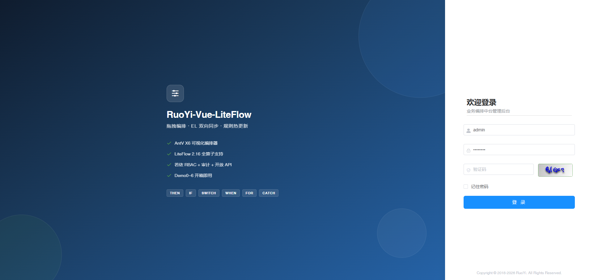
</p>

<p align="center">
  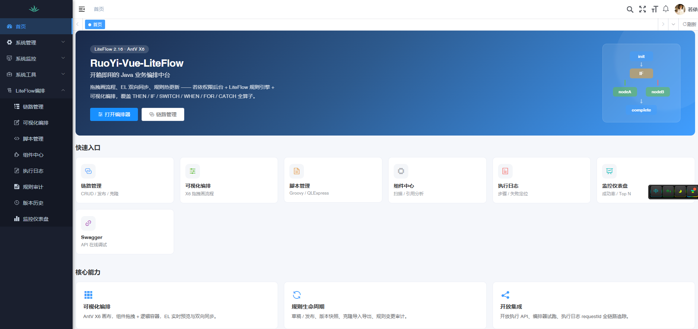
</p>

<table>
  <tr>
    <td width="50%">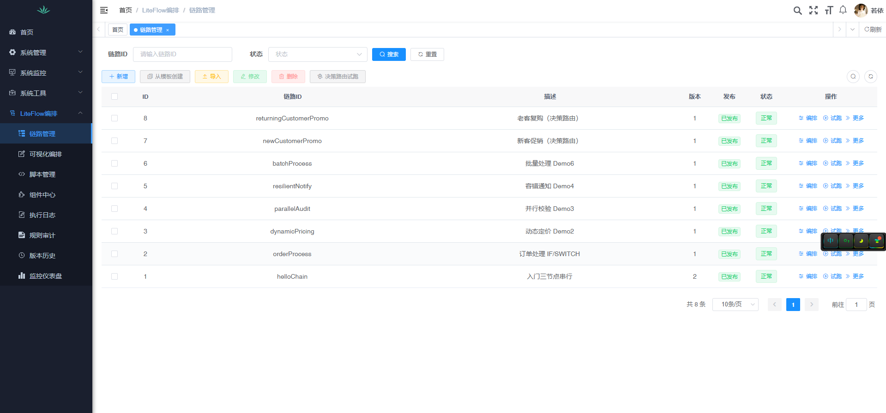</td>
    <td width="50%">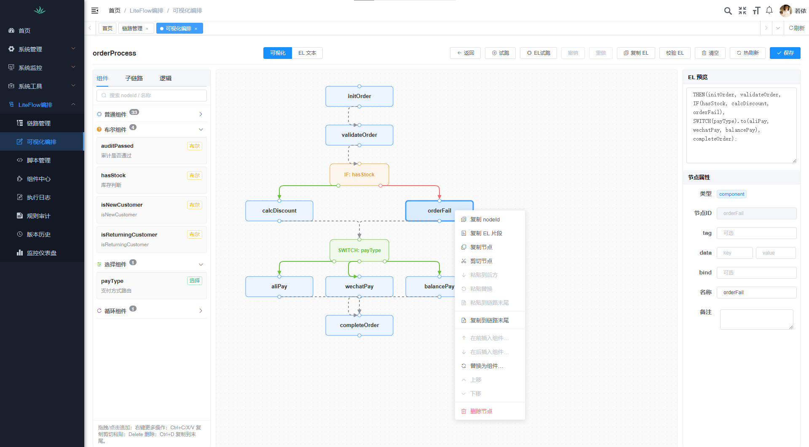</td>
  </tr>
  <tr>
    <td>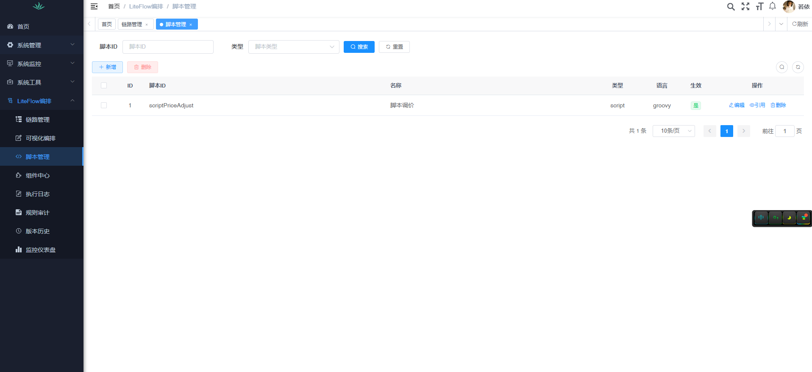</td>
    <td>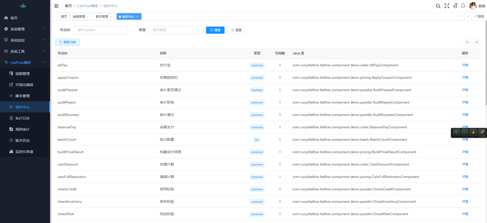</td>
  </tr>
  <tr>
    <td>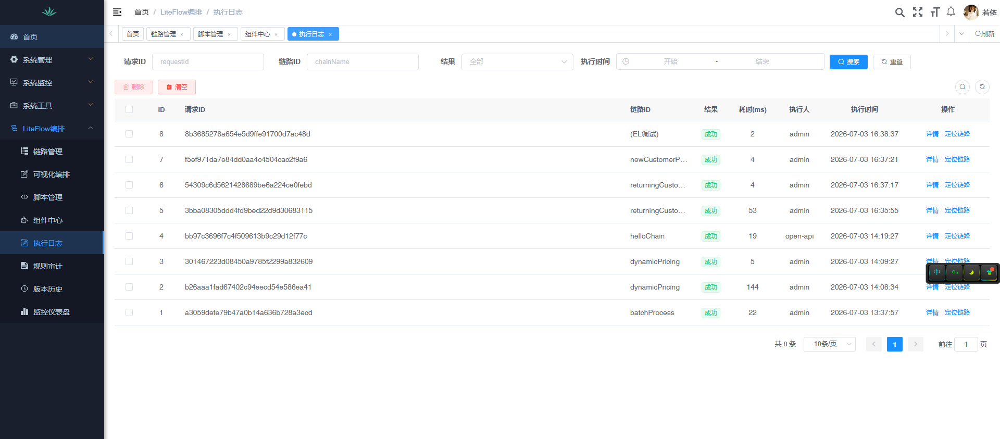</td>
    <td>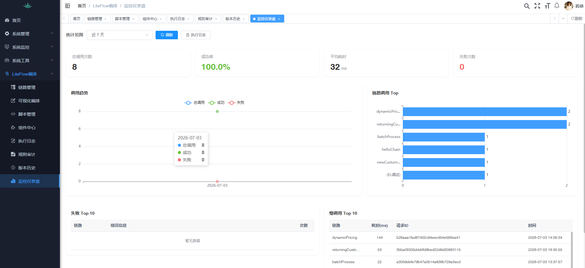</td>
  </tr>
  <tr>
    <td colspan="2">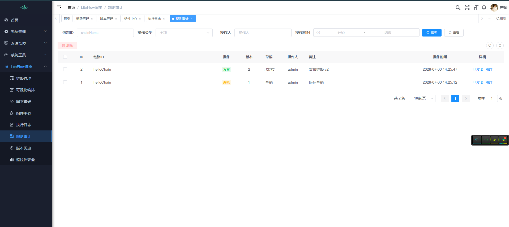</td>
  </tr>
</table>

### AI 能力界面

<table>
  <tr>
    <td width="50%"></td>
    <td width="50%"></td>
  </tr>
  <tr>
    <td colspan="2"></td>
  </tr>
  <tr>
    <td></td>
    <td>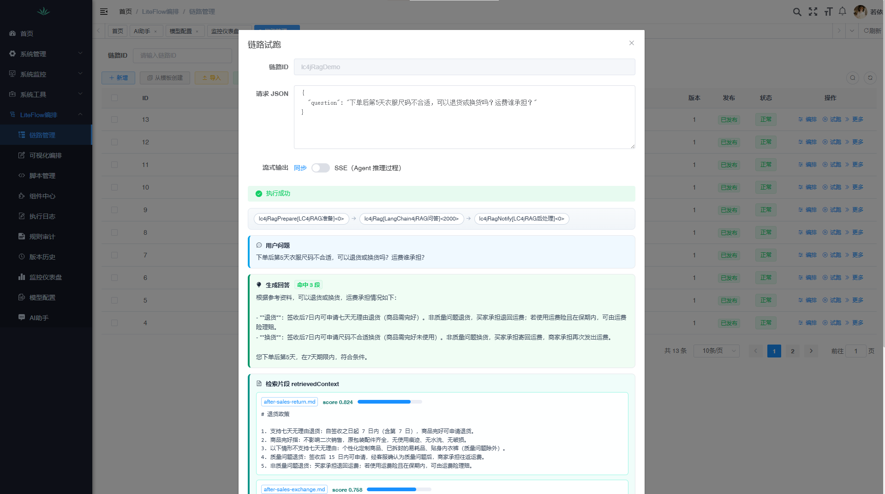</td>
  </tr>
</table>

更多截图说明见 [docs/img/README.md](docs/img/README.md)。

---

## 架构概览

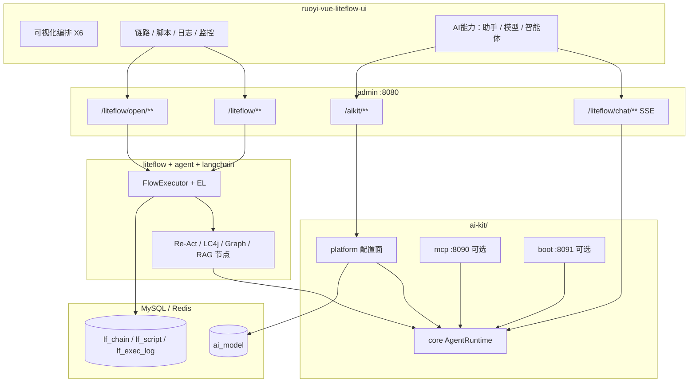

**分层约定：**

- LiteFlow EL：外层业务编排（校验、分支、落库、通知）
- AI 节点：内层智能能力（Re-Act / Chat+Tool / 状态图 / RAG）
- 内部 AI 助手：独立会话 API，不走链路 EL；可选绑定智能体或模型
- AI Kit：`ai-kit/` 独立模块族，配置面嵌入 admin；日常不必启 MCP / boot
- `lf_chain.el_data` 为执行权威；`graph_json` 为画布快照；发布后热刷新

---

## 与相关方案对比

| 维度 | 本项目中台 | 仅用 LiteFlow 引擎 | Flowable / Camunda |
|------|------------|-------------------|---------------------|
| 可视化编排 | ✅ AntV X6 Web 编排器 | ❌ 需自建或手写 EL | ✅ BPMN 流程图 |
| 规则热更新 | ✅ SQL 源 + 发布/热刷新 | ✅ 支持 | 流程部署模型不同 |
| 权限 / 审计 | ✅ 若依 RBAC + 链路权限 | ❌ 需自建 | ✅ 工作流权限体系 |
| 执行日志 / 监控 | ✅ 内置 | ❌ 需自建 | ✅ 流程历史 |
| AI 混编 | ✅ Re-Act / LC4j / LG4j / RAG / 内部助手 | ❌ 需自建 | 需自行扩展 |
| 适用场景 | 业务逻辑编排、策略链、智能节点 | 嵌入式规则 | 人工审批、长流程 |
| 学习成本 | 低（Demo 矩阵 + 文档） | 中 | 高 |

---

## 技术栈

| 层级 | 技术 |
|------|------|
| 后端 | RuoYi 3.9.2 · Spring Boot 4.0.6 · JDK 17 |
| 规则引擎 | LiteFlow **2.16.0**（`liteflow-spring-boot4-starter` + SQL 规则源） |
| AI | LangChain4j **1.17.2** · LangGraph4j **1.8.20** · 本地 All-MiniLM Embedding |
| 前端 | Vue 2 · Element UI · AntV X6 2.x |
| 数据库 | MySQL 8 + Redis |

---

## Quick Start

### 1. 环境要求

- JDK 17+
- Maven 3.8+
- Node.js 16+（前端）
- MySQL 8 + Redis（若依默认）

### 2. 初始化数据库

```sql
CREATE DATABASE IF NOT EXISTS `ry-vue` DEFAULT CHARACTER SET utf8mb4;
```

```bash
mysql -u root -p ry-vue < sql/ry-vue.sql
```

全量脚本已包含若依基础表、LiteFlow 表、Demo 链路（含 Agent / LangChain / RAG / 决策路由 / `aiKitAgentDemo`）、**AI Kit** 与 **AI 助手**。按本机修改 `ruoyi-vue-liteflow-admin/src/main/resources/application-druid.yml`（默认库 `ry-vue`，账号 `root` / `root`）。

> **安全提示：** 生产请改默认账号 `admin/admin123`、`liteflow.open-api.api-key`、`RUOYI_MCP_API_KEY`、AES `RUOYI_AI_AES_SECRET`。模型 API Key 勿写入仓库，用「AI能力 → 模型管理」或 `DEEPSEEK_API_KEY`。

### 3. 启动后端

```bash
cd ruoyi-vue-liteflow-admin
mvn spring-boot:run
```

或在 IDE 中运行 `com.ruoyiliteflow.RuoYiApplication`。

首次启动若启用 RAG，会加载本地 Embedding 模型并索引 `classpath:kb/*.md`，耗时可稍长。

### 4. 启动前端

```bash
cd ruoyi-vue-liteflow-ui
npm install
npm run dev
```

浏览器访问控制台提示地址，默认账号：**admin / admin123**。

### 5. （可选）仅 AI Kit（MCP + Agent），不启 admin

无需 MySQL。配置 `DEEPSEEK_API_KEY` 后，在 IDEA 运行：

1. `com.ruoyiliteflow.mcp.McpServerApplication` → http://localhost:8090/
2. `com.ruoyiliteflow.aikit.boot.AiKitBootApplication` → http://localhost:8091/

说明见 [docs/MCP_AGENT.md](docs/MCP_AGENT.md)。

### 6. 快速体验

1. 登录 → **LiteFlow编排 → 链路管理**
2. 对 `helloChain` 点击 **试跑**
3. **AI能力 → 模型管理** 录入 DeepSeek Key 并设为默认后，可依次试跑 `agentRiskDemo` / `lc4jChatDemo` / `lc4jGraphDemo` / `lc4jRagDemo` / `aiKitAgentDemo`
4. 打开 **AI能力 → AI助手**，进行多轮对话（复用同一默认模型）
5. 点击 **编排** 打开可视化编辑器，拖拽组件并保存 / 发布

---

## Demo 矩阵

| 链路 ID | 算子亮点 | 说明 |
|---------|----------|------|
| `helloChain` | THEN | 三节点串行入门 |
| `orderProcess` | IF · SWITCH | 订单校验与支付路由 |
| `dynamicPricing` | 脚本组件 | Groovy / QLExpress 动态定价 |
| `parallelAudit` | WHEN | 并行风控校验 |
| `resilientNotify` | CATCH · RETRY | 容错与重试 |
| `batchProcess` | FOR | 批量循环处理 |
| `newCustomerPromo` / `returningCustomerPromo` | 决策路由 | namespace=`routeDemo` |
| `fallbackDemo` | 声明式 · FallbackCmp | `node("ghostNode")` 降级为 `fallbackCommon` |
| `agentRiskDemo` | Re-Act Agent | DeepSeek 风控节点 |
| `lc4jChatDemo` | LangChain4j | AiServices + Tool 风控 |
| `lc4jGraphDemo` | LangGraph4j | StateGraph 条件边风控 |
| `lc4jRagDemo` | LangChain4j RAG | 售后知识库问答 |
| `aiKitAgentDemo` | AI Kit 薄适配 | 配置驱动智能体节点 |

样例请求 JSON：[docs/demo/](docs/demo/README.md)

**独立进程（非链路 Demo）：** 无需启动 admin / 前端。MCP `:8090` + AI Kit Boot `:8091`（Chat/Risk/RAG/Ops 合一），浏览器打开各端口首页即可。详见 [docs/MCP_AGENT.md](docs/MCP_AGENT.md)、[docs/demo/agent/](docs/demo/agent/README.md)。

**决策路由试跑：** 链路管理 → **决策路由试跑**

```json
{
  "namespace": "routeDemo",
  "contextClass": "com.ruoyiliteflow.liteflow.domain.context.RouteUserContext",
  "param": { "userType": "NEW" }
}
```

将 `userType` 改为 `RETURNING` 可命中老客复购链。

---

## AI 能力

### 1. LiteFlow Re-Act（`agentRiskDemo`）

把 DeepSeek（OpenAI 兼容）封装为链路中的 Re-Act Agent 节点，可与普通组件混编。

1. **AI能力 → 模型管理**：新增模型并设为默认；或设置环境变量 `DEEPSEEK_API_KEY`
2. 试跑链路 `agentRiskDemo`

开放 API 默认 **禁止** 含 Agent 类节点的链路（`liteflow.open-api.allow-agent-chains=false`）。详见 [docs/AGENT.md](docs/AGENT.md)。

### 2. LangChain4j / LangGraph4j / RAG

独立模块 `ruoyi-vue-liteflow-langchain`，与 Re-Act Agent **并存**，共用模型配置与配额：

| 链路 | 框架 | 节点 | 能力 |
|------|------|------|------|
| `lc4jChatDemo` | LangChain4j | `lc4jChat` | AiServices + Tool Calling |
| `lc4jGraphDemo` | LangGraph4j | `lc4jGraph` | StateGraph + 条件边（escalate / pass） |
| `lc4jRagDemo` | LangChain4j RAG | `lc4jRag` | 本地 Embedding 检索 + Chat 生成 |

RAG 默认知识库位于模块资源目录 `ruoyi-vue-liteflow-langchain/src/main/resources/kb/`（退货 / 换货 / 运费政策），可按同样方式扩展 `.md` 文档。

试跑对话框会对 `riskLevel`、`graphTrace`、`retrievedContext`、`answer` 等字段做卡片化展示，完整 JSON 默认折叠。

详细说明：[docs/LANGCHAIN.md](docs/LANGCHAIN.md)

### 3. 内部 AI 助手

菜单 **AI能力 → AI助手**：后台多轮对话 + SSE 流式输出，复用「模型管理」默认模型与日配额。

| 能力 | 说明 |
|------|------|
| 会话 | 仅本人可见，软删除；侧栏可折叠 |
| 选择器 | 新对话可选 **智能体** 或 **模型**；发出后本会话锁定 |
| 上下文 | 轻量：最近 N 条；智能体：走 Kit 记忆 |
| 交互 | 流式输出、停止生成、Markdown 渲染、复制 |

详见 [docs/CHAT.md](docs/CHAT.md)。

### 4. MCP Server + 独立多 Agent（AI Kit）

将系统能力封装为 **MCP Tools**，再以 **AI Kit Boot** 单进程消费（**不依赖 LiteFlow EL**）：

| 进程 | 端口 | 说明 |
|------|------|------|
| `McpServerApplication` | 8090 | Tools + HTTP Playground（http://localhost:8090/） |
| `AiKitBootApplication` | 8091 | Chat / Risk / RAG / Ops 合一（http://localhost:8091/） |

- 鉴权：`X-MCP-Api-Key`（默认 `ruoyi-mcp-key-change-me`，可用 `RUOYI_MCP_API_KEY`）
- 模型：环境变量 `DEEPSEEK_API_KEY`
- 与后台「AI助手」菜单：**并存**；菜单仍走 `/liteflow/chat`（8080），AI Kit 走 8090/8091
- Maven 模块：均在 `ai-kit/` 下（`ai-kit-core` / `mcp` / `boot` / `platform`，可抽到其他项目复用）

详细说明：[docs/MCP_AGENT.md](docs/MCP_AGENT.md)

### 5. AI Kit 配置面（嵌入 admin）

日常使用 **`RuoYiApplication`（:8080）** 即可管理 AI Kit，无需单独启 boot：

1. 导入 [sql/ry-vue.sql](sql/ry-vue.sql) 后**重新登录**，侧栏出现 **AI能力**
2. 菜单：模型 / 工具 / 智能体 / 知识库 / 技能 / 记忆 / 上下文策略
3. 智能体支持绑定工具、知识库、技能与上下文策略；试跑走 `POST /aikit/agent/{code}/run`
4. 配置 `DEEPSEEK_API_KEY`，或在「模型管理」写入加密 Key

可选独立进程：`ai-kit-boot`（:8091，`platform` profile）配置驱动试跑；MCP Playground 见 [docs/demo/mcp-ai-core/](docs/demo/mcp-ai-core/README.md)。

### 6. 可选配置

```yaml
liteflow:
  agent:
    openai-compatible:
      deepseek:
        api-key: ${DEEPSEEK_API_KEY:}
        base-url: ${DEEPSEEK_BASE_URL:https://api.deepseek.com/v1}
    demo:
      model: ${DEEPSEEK_MODEL:deepseek-chat}
  chat:
    history-limit: 20
    temperature: 0.3
  langchain:
    rag:
      max-results: 3
      min-score: 0.45
```

---

## 文档

| 文档 | 说明 |
|------|------|
| [docs/EDITOR.md](docs/EDITOR.md) | 可视化编排器使用指南 |
| [docs/API.md](docs/API.md) | 内部 / 开放执行 API / Webhook |
| [docs/AGENT.md](docs/AGENT.md) | Re-Act Agent（DeepSeek） |
| [docs/LANGCHAIN.md](docs/LANGCHAIN.md) | LangChain4j / LangGraph4j / RAG |
| [docs/CHAT.md](docs/CHAT.md) | 内部 AI 助手（多轮对话 + SSE） |
| [docs/MCP_AGENT.md](docs/MCP_AGENT.md) | AI Kit：MCP + 独立 Agent + 配置面 |
| [docs/demo/](docs/demo/README.md) | Demo 请求样例 |

Swagger：启动后访问 `/swagger-ui.html`，分组 **LiteFlow编排** / **LiteFlow开放API**。

---

## 项目结构

```
RuoYi-Vue-LiteFlow/
├── ruoyi-vue-liteflow-liteflow/   # LiteFlow 核心：组件、链路、执行、审计
├── ruoyi-vue-liteflow-agent/      # Re-Act Agent（DeepSeek）扩展模块
├── ruoyi-vue-liteflow-langchain/  # LangChain4j / LangGraph4j / RAG 扩展模块
├── ai-kit/                        # AI Kit（与 LiteFlow 解耦）
│   ├── ruoyi-vue-liteflow-ai-kit-core/      # Facade / AgentRuntime
│   ├── ruoyi-vue-liteflow-ai-kit-platform/  # 模型/工具/智能体配置面
│   ├── ruoyi-vue-liteflow-ai-kit-mcp/       # MCP Server :8090
│   └── ruoyi-vue-liteflow-ai-kit-boot/      # Agent 示例合一进程 :8091
├── ruoyi-vue-liteflow-admin/      # Spring Boot 启动与 REST API
├── ruoyi-vue-liteflow-ui/         # Vue 管理前端（含 LiteFlowEditor）
├── sql/                           # 全量初始化 sql/ry-vue.sql
├── docs/                          # 用户文档与截图 docs/img/
├── docker/                        # Docker 构建文件
└── docker-compose.yml             # 一键部署骨架
```

---

## Docker（可选）

```bash
docker compose up -d --build
```

首次使用需将 SQL 导入 MySQL 卷，详见 [docker/mysql/init/README.md](docker/mysql/init/README.md)。

---

## 模块与菜单

登录后左侧 **LiteFlow编排** 菜单：

| 菜单 | 功能 |
|------|------|
| 链路管理 | CRUD、发布、试跑（含 AI 洞察）、克隆、导入导出、决策路由试跑 |
| 可视化编排 | X6 编排器 |
| 脚本管理 | 多语言脚本在线编辑 |
| 组件中心 | 扫描组件、引用分析 |
| 执行日志 | 步骤详情、失败定位 |
| 规则审计 | EL 变更记录 |
| 版本历史 | 快照、diff、回滚 |
| 监控仪表盘 | 成功率与 Top 排行 |

**AI能力** 模块：模型管理（统一 Key / 配额）、AI助手、工具 / 智能体 / 知识库 / 技能 / 记忆 / 上下文。

---

## 常见问题

**Q：保存后执行仍是旧逻辑？**  
A：保存为草稿，需在链路管理 **发布** 后才会热刷新。

**Q：试跑提示链路未启用？**  
A：确认链路 **已发布** 且状态为正常。

**Q：开放 API 401？**  
A：检查请求头 `X-LiteFlow-Api-Key` 或具备权限 `liteflow:open:execute` 的 Token。

**Q：决策路由无命中？**  
A：确认库中存在 `newCustomerPromo` / `returningCustomerPromo`（namespace=`routeDemo`）且已发布，并对链路 **热刷新** 或重启后端。

**Q：Agent / LangChain / RAG / AI助手 失败？**  
A：检查「AI能力 → 模型管理」或 `DEEPSEEK_API_KEY`、账户余额，以及是否已导入 [sql/ry-vue.sql](sql/ry-vue.sql)。RAG 首次启动需成功加载 Embedding。详见 [docs/AGENT.md](docs/AGENT.md)、[docs/LANGCHAIN.md](docs/LANGCHAIN.md)、[docs/CHAT.md](docs/CHAT.md)。

**Q：内部 AI 助手和链路里的 Agent 有何区别？**  
A：AI 助手是后台多轮聊天页（菜单在「AI能力」，接口 `/liteflow/chat`），不走 EL 链路；Agent / LangChain 节点挂在 `lf_chain` 上，与业务组件混编试跑。二者共用模型管理与配额。

**Q：如何体验 MCP / 独立 Agent？需要开前端吗？**  
A：不需要。配置 `DEEPSEEK_API_KEY` 后启动 `McpServerApplication`（8090）与 `AiKitBootApplication`（8091），浏览器访问对应首页即可。详见 [docs/MCP_AGENT.md](docs/MCP_AGENT.md)。

**Q：如何只使用编排能力、不启用 AI？**  
A：可不配置模型 Key；未执行 AI Demo 链路时不影响普通业务 Demo。亦可在 Maven 中不依赖 `ruoyi-vue-liteflow-langchain` / `ruoyi-vue-liteflow-agent`（需同步调整 admin 模块依赖）。`ai-kit-*` 独立进程也可不启动。

---

## 路线图

当前 **v3.10.0** 已覆盖：可视化编排、草稿发布、执行日志与监控、开放 API、AI Kit 配置面（模型 / 工具 / 智能体 / 助手）。下面是后续打算做的事，欢迎按条目提 Issue / PR。

| 里程碑 | 规划 | 状态 |
|--------|------|------|
| **生产闭环** | Docker 一键启动；链路试跑用例与发布前回归；开放 API 示例客户端；Webhook 签名与重试；已发布链路可作为智能体 / MCP 工具；规则包导入导出 | 规划中 |
| **编排增强** | HTTP 等一等公民节点；TraceId 贯穿执行与回调；场景模板包；多模型供应商与配额可视；异步执行与幂等；失败告警；脚本沙箱；日志脱敏；版本灰度 | 规划中 |
| **生态与规模** | 定时 / 入站 Webhook / MQ 触发；第三方节点扩展包；多实例与限流；规则同步 Git；助手辅助生成 / 解释 EL；租户隔离 | 规划中 |

不做：C 端通用聊天、第二套替代 LiteFlow 的画布、对标 Flowable 的 BPMN。内部助手保持运维 / 开发自用。

---

## 贡献

欢迎 Issue / PR。本地改动请保持与现有模块风格一致；涉及安全（开放 API、模型 Key、只读模式）请补充说明。

---

## 致谢

- [RuoYi-Vue](http://ruoyi.vip/) — 后台权限与基础框架
- [LiteFlow](https://gitee.com/dromara/liteFlow) — 轻量级规则引擎（Apache 2.0）
- [LiteFlow AI Agent](https://liteflow.cc/) — Re-Act Agent 扩展
- [LangChain4j](https://docs.langchain4j.info/) — Java LLM 应用框架
- [LangGraph4j](https://github.com/langgraph4j/langgraph4j) — Java 有状态 Agent 图
- [Model Context Protocol](https://modelcontextprotocol.io/) — Agent 工具协议
- [AntV X6](https://x6.antv.antgroup.com/) — 图编辑引擎
- [DeepSeek](https://www.deepseek.com/) — 本仓库 Demo 默认模型供应商

---

## 联系方式

- **邮箱**: mrzhaopro@qq.com

---

**如果这个项目对你有帮助，请给个 Star 支持一下！**

## License

本项目基于若依框架，遵循 **MIT License**（见 [LICENSE](LICENSE)）。  
LiteFlow 遵循 **Apache License 2.0**，使用时请保留相应版权声明。  
LangChain4j / LangGraph4j 等第三方库遵循各自开源协议。
