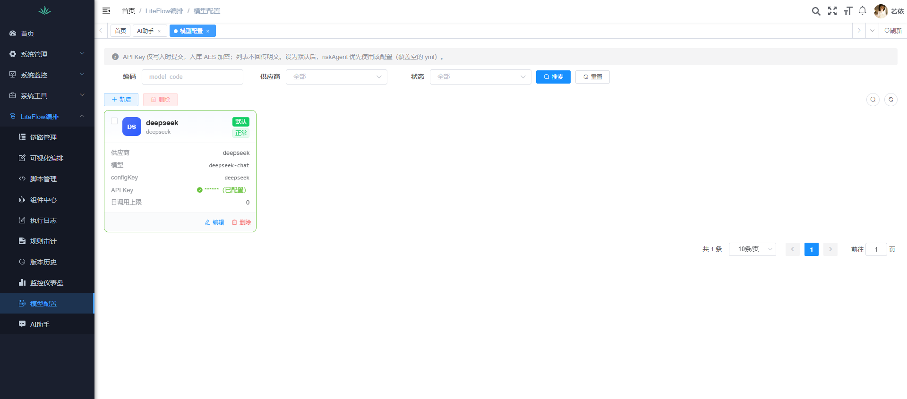
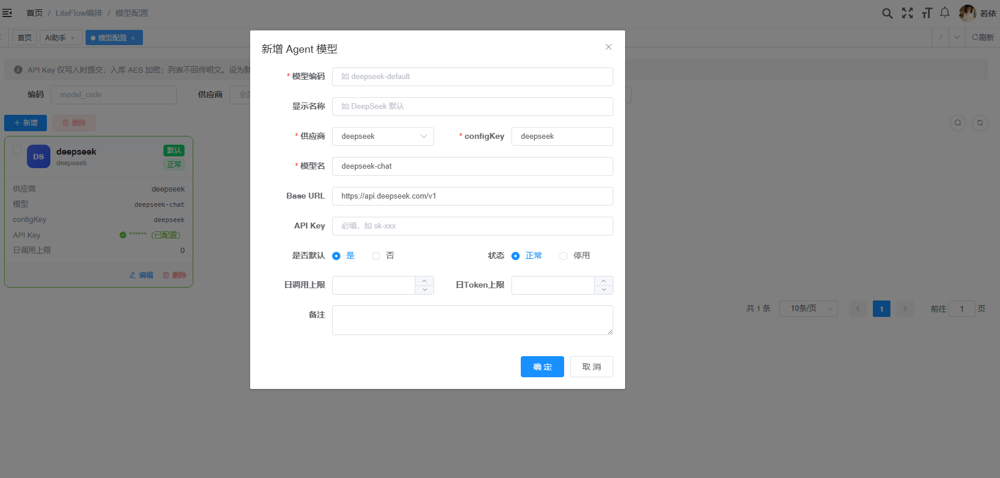

# LiteFlow Re-Act Agent（Phase 4）

把 **DeepSeek（OpenAI 兼容）** 封装为链路中的 Agent 节点，可与普通组件混编。

## 前置条件

1. JDK 17+
2. DeepSeek 平台 API Key（[platform.deepseek.com](https://platform.deepseek.com/) → API keys）
3. 账户余额可用（用量页若提示「余额不足，未开启」，请先充值）
4. 已导入全量库表 [sql/ry-vue.sql](../sql/ry-vue.sql)（含 `agentRiskDemo`、`lf_agent_model` 与菜单）

## 配置 Key（二选一）

### 推荐：后台「模型管理」

1. 登录 → **AI能力 → 模型管理**
2. 新增 DeepSeek 模型，填写 API Key，勾选 **默认**
3. Key AES 加密入库，接口只返回 `******（已配置）`

<p align="center">
  
</p>

<p align="center">
  
</p>

### 回退：yml / 环境变量

```yaml
liteflow:
  agent:
    workspace:
      root: ./data/liteflow-agent-workspaces   # 必填
    shell:
      mode: DISABLED
    crypto:
      secret: ${LITEFLOW_AGENT_AES_SECRET:ruoyi-liteflow-aes}
    quota:
      enabled: true
      daily-call-limit: 100
      daily-token-limit: 200000
      daily-chain-call-limit: 200
    openai-compatible:
      deepseek:
        api-key: ${DEEPSEEK_API_KEY:}
        base-url: ${DEEPSEEK_BASE_URL:https://api.deepseek.com/v1}
    demo:
      model: ${DEEPSEEK_MODEL:deepseek-chat}
```

```powershell
$env:DEEPSEEK_API_KEY='sk-xxxxxxxx'
```

运行时优先级：**库中默认启用模型的 Key** > yml/环境变量。

未配置 Key 时项目仍可启动；执行 `agentRiskDemo` 会在调用模型时报错。

## Demo7：`agentRiskDemo`

```text
THEN(agentPrepare, riskAgent, agentNotify)
```

| 节点 | 说明 |
|------|------|
| `agentPrepare` | 整理订单入参到 `AgentRiskContext` |
| `riskAgent` | DeepSeek Re-Act Agent，可调 Tool |
| `agentNotify` | 解析回复，写入 `riskLevel` |

Tool：

- `read_order_risk_context`：读当前风控上下文
- `query_chain_meta`：查 `lf_chain` 元数据

试跑（后台需登录）：

```http
POST /liteflow/execute/agentRiskDemo
Content-Type: application/json

{
  "orderId": "ORD-AGENT-1001",
  "userId": 1001,
  "userType": "NEW",
  "amount": 1299.00,
  "scene": "checkout"
}
```

样例：[demo/agentRiskDemo-request.json](demo/agentRiskDemo-request.json)

### 流式试跑（SSE）

链路管理试跑对话框可打开 **SSE（Agent 推理过程）**，或直接调用：

```http
POST /liteflow/execute/stream/agentRiskDemo
Authorization: Bearer <token>
Content-Type: application/json
Accept: text/event-stream

{ "orderId": "ORD-AGENT-1001", "userId": 1001, "userType": "NEW", "amount": 1299, "scene": "checkout" }
```

事件名：`agent.reasoning` / `agent.tool_result` / `agent.result` / `done`（最终结果） / `error`。

## 安全说明

- Shell / 工作区文件 Tool 默认关闭（`enableShellTool=false`）
- API Key：后台「AI能力 → 模型管理」AES 加密入库；yml 仅作回退，勿提交 Git
- 开放 API：默认 **禁止** 含 Agent 的链路。按链路放行 `liteflow.open-api.allow-agent-chain-names`，或全局 `allow-agent-chains=true`
- 日配额：Redis 计数单用户调用/Token 与单链路调用（`liteflow.agent.quota.*`）
- `GET /liteflow/config` 仅返回 `agentConfigured` 布尔值，不回传密钥

## 扩展

新增 Agent：继承 `ReActAgentComponent`，实现 `model()` / `systemPrompt()` / `userPrompt()`，用 `@LiteflowComponent` 注册后即可写进 EL。
编排器左侧组件面板会按 `nodeType=agent` 分组展示（青色节点）。

## 与 Flowable / 纯 LLM 对比（简表）

| 维度 | 本方案（LiteFlow + Re-Act Agent） | Flowable | 纯 LLM 调用 |
|------|----------------------------------|----------|------------|
| 编排单元 | EL 节点（含 Agent 节点）可混编 | BPMN 流程人机任务为主 | 单次/链式 Prompt，缺业务图 |
| 确定性业务 | 普通 Java/脚本组件保证 | 适合长事务人工审批 | 弱 |
| LLM 推理 | Agent 节点按需调用 + Tool | 需自行扩展 | 直接调 API |
| 运维 | 链路热刷新、执行日志、日配额 | 流程引擎运维栈 | 无统一链路观察 |
