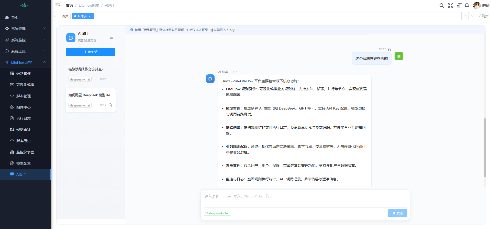

# 内部 AI 助手（Phase 6）

后台轻量多轮对话：复用「AI能力 → 模型管理」默认模型（DeepSeek / OpenAI 兼容）与 Agent 日配额，支持 SSE 流式输出、会话历史、侧栏折叠与停止生成。

<p align="center">
  
</p>

> 定位：编排中台内的 **内部助手**，不是对标豆包 / Kimi 的独立聊天产品。

## 前置条件

1. 已配置默认模型 Key（**AI能力 → 模型管理**），或环境变量 `DEEPSEEK_API_KEY`
2. 已导入全量脚本 [sql/ry-vue.sql](../sql/ry-vue.sql)（含 `lf_chat_*`、AI Kit 表，AI助手在 **AI能力** 下）
3. 重新登录（或清菜单缓存）以加载权限

## 功能

| 能力 | 说明 |
|------|------|
| 会话列表 | 仅本人可见，软删除；支持侧栏折叠（localStorage） |
| 选择器 | 新对话可选 **智能体** 或 **模型**；发出后本会话锁定 |
| 多轮上下文 | 轻量模式：最近 N 条拼进 Prompt；智能体模式：走 Kit 记忆 |
| SSE 流式 | `delta` 增量 / `done` 完成 / `error` 失败；可中途停止 |
| Markdown | 轻量渲染标题 / 加粗 / 列表 / 代码块 |
| 配额 | 走 `IAgentQuotaService`，虚拟链路名 `aiChat` |

## 菜单与权限

| 权限 | 说明 |
|------|------|
| `liteflow:chat:list` | 打开 AI 助手页 |
| `liteflow:chat:query` | 拉取消息 |
| `liteflow:chat:send` | 新建会话 / 发送 |
| `liteflow:chat:remove` | 删除会话 |

路径：`AI能力 → AI助手` → 组件 `liteflow/chat/index`（接口仍为 `/liteflow/chat`）

## 快速体验

1. **AI能力 → 模型管理**：新增 DeepSeek 模型并设为默认  
2. **AI能力 → AI助手**：新建对话，例如「这个系统有哪些功能」  
3. 观察流式输出与会话列表自动标题

相关截图：[模型配置1.png](img/模型配置1.png) · [模型配置2.png](img/模型配置2.png)

若侧栏仍见旧「LiteFlow编排 → 模型配置 / AI助手」，重新导入 [sql/ry-vue.sql](../sql/ry-vue.sql) 后重新登录。

## API

```http
GET  /liteflow/chat/session/list
POST /liteflow/chat/session
GET  /liteflow/chat/session/{id}/messages
DELETE /liteflow/chat/session/{ids}

POST /liteflow/chat/stream
Content-Type: application/json
Accept: text/event-stream

{ "sessionId": 1, "content": "LiteFlow THEN 和 WHEN 有什么区别？", "modelCode": "deepseek-default", "agentCode": "" }
```

`sessionId` 可省略，服务端自动建会话。`agentCode` 与 `modelCode` 二选一：智能体走 Kit（工具/知识库/技能），模型走轻量对话；空则用默认模型。

`GET /liteflow/chat/options` 返回可选模型与已启用智能体。

会话表含 `agent_code`（全量脚本已包含）。

## 配置

```yaml
liteflow:
  chat:
    history-limit: 20
    temperature: 0.3
    system-prompt: "你是 RuoYi-Vue-LiteFlow 平台的内部 AI 助手。..."
```

模型凭据优先级与 LangChain Demo 相同：库中默认启用模型 > yml / `DEEPSEEK_API_KEY`。

## 实现位置

| 层 | 路径 |
|----|------|
| 服务 | `ruoyi-vue-liteflow-langchain` → `ILfChatService` |
| 流式模型 | `Lc4jChatModelFactory#createStreamingChatModel` |
| 控制器 | `LfChatController` `/liteflow/chat` |
| 前端 | `views/liteflow/chat/index.vue`、`api/liteflow/chat.js` |
| 表 | `lf_chat_session` / `lf_chat_message` |
